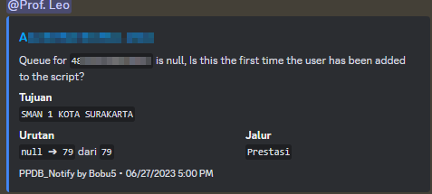
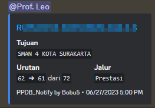
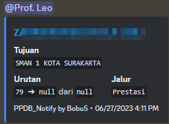
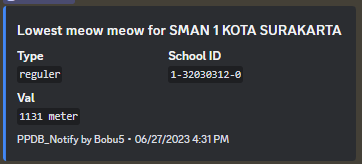
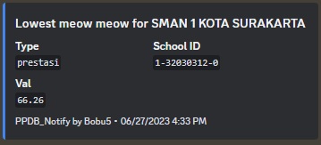

# PPDB-Notify
My attempt on automatically tracking PPDB Ranking from Indonesia Central Java State owned schools registration site [https://ppdb.jatengprov.go.id/]

> Project will be mostly inactive, but any issue will still be responded and PRs are welcomed

## Introduction

### Why?
The project started back in July 2023 as i was too lazy to check up on my ranking on the indonesian public school registration website but at the same time is always concerned about my own ranking, as the official app doesn’t have the option to enable notification for position changes, i ended up writing this code for my friend and myself.

### How did you implemented it?
The script was first meant to be used with cron on a debian based system, though anything that could run bash and cron should be able to run this script aswell

## Getting Started

### Dependencies

- `sed` (Stream editing)
- [jq][jq] (JSON parsing)
- [curl][curl] (http requests)
- [fieu’s discord.sh](https://github.com/fieu/discord.sh)

Also Required by discord.sh

- [bash][bash] (GNU Bourne-Again SHell)
- [bats][bats] (tests)
- [base64][base64] (webhook avatar modification)
- [file][file] (MIME type retrieval for webhook avatar modification)

for `jq` and `sed` it can be easily installed with the following command
```sh
apt-get update && apt-get install jq sed -y
```

### Running the script
1. clone the repo and add permissions
    ```sh
    git clone
    cd ppdb-notify
    chmod +X ./src/*
    ```
2. Download [latest discord.sh from its repo][discord.sh-rel] and put it in the same folder as the scripts

    If this is not an option, you could use the provided discord.sh on `samples/`
2. Configure each script (Individual and/or School notif) with the instructions provided on the file
3. Configuring crontab

    Run the following command
    ```sh
    crontab -e
    ```
    add and configure the following entry onto your own path
    ```sh
    ### PPDB Notify
    * * * * * /bin/bash /home/sandbox/ppdb-notify/src/individual-notif.sh
    * * * * * /bin/bash /home/sandbox/ppdb-notify/src/school-notif.sh
    ##
    ```
    To make it check every few seconds (In this example 5 second) use the following entries instead
    ```sh
    ### PPDB Notify
    * * * * * ( /bin/bash /home/sandbox/ppdb-notify/src/individual-notif.sh )
    * * * * * ( sleep 5 ; /bin/bash /home/sandbox/ppdb-notify/src/individual-notif.sh )
    * * * * * ( sleep 10 ; /bin/bash /home/sandbox/ppdb-notify/src/individual-notif.sh )
    * * * * * ( sleep 15 ; /bin/bash /home/sandbox/ppdb-notify/src/individual-notif.sh )
    * * * * * ( sleep 20 ; /bin/bash /home/sandbox/ppdb-notify/src/individual-notif.sh )
    * * * * * ( sleep 35 ; /bin/bash /home/sandbox/ppdb-notify/src/individual-notif.sh )
    * * * * * ( sleep 40 ; /bin/bash /home/sandbox/ppdb-notify/src/individual-notif.sh )
    * * * * * ( sleep 45 ; /bin/bash /home/sandbox/ppdb-notify/src/individual-notif.sh )
    * * * * * ( sleep 50 ; /bin/bash /home/sandbox/ppdb-notify/src/individual-notif.sh )
    * * * * * ( sleep 55 ; /bin/bash /home/sandbox/ppdb-notify/src/individual-notif.sh )

    * * * * * ( /bin/bash /home/sandbox/ppdb-notify/src/school_notif.sh )
    * * * * * ( sleep 5 ; /bin/bash /home/sandbox/ppdb-notify/src/school_notif.sh )
    * * * * * ( sleep 10 ; /bin/bash /home/sandbox/ppdb-notify/src/school_notif.sh )
    * * * * * ( sleep 15 ; /bin/bash /home/sandbox/ppdb-notify/src/school_notif.sh )
    * * * * * ( sleep 20 ; /bin/bash /home/sandbox/ppdb-notify/src/school_notif.sh )
    * * * * * ( sleep 35 ; /bin/bash /home/sandbox/ppdb-notify/src/school_notif.sh )
    * * * * * ( sleep 40 ; /bin/bash /home/sandbox/ppdb-notify/src/school_notif.sh )
    * * * * * ( sleep 45 ; /bin/bash /home/sandbox/ppdb-notify/src/school_notif.sh )
    * * * * * ( sleep 50 ; /bin/bash /home/sandbox/ppdb-notify/src/school_notif.sh )
    * * * * * ( sleep 55 ; /bin/bash /home/sandbox/ppdb-notify/src/school_notif.sh )
    ##
    ```

    Note: Replace `/home/sandbox/ppdb-notify/src` with your own path to the script(s)
## Previews
* Some of the following screenshots are using an old build release, primarly `School Notif`
* furthermore Samples of the datas are uploaded onto `docs/` aswell
### Individual Notif
First time running the script



When an entry is updated



When a specified userid's entry went off the leaderboard


### School Notif
Lowest value on reguler (Zonasi)



Lowest value on prestasi



---
### Todos
- [x] Write a basic readme
- [ ] Add empty data handling
- [ ] Rewrite webhook mechanism and remove [fieu’s discord.sh](https://github.com/fieu/discord.sh) dependency
- [ ] Add more Previews once they reopened the API
- [ ] Revamp School Notif (Add UserID & Name)
- [ ] Add slack integration

<!-- Programs -->
[discord.sh]: https://github.com/fieu/discord.sh
[discord.sh-rel]: https://github.com/fieu/discord.sh/releases
[curl]: https://curl.haxx.se/
[bash]: https://www.gnu.org/software/bash/
[bats]: https://github.com/bats-core/bats-core
[jq]: https://stedolan.github.io/jq/
[base64]: https://wiki.openssl.org/index.php/Command_Line_Utilities#Base64_Encoding_Strings
[file]: https://github.com/file/file